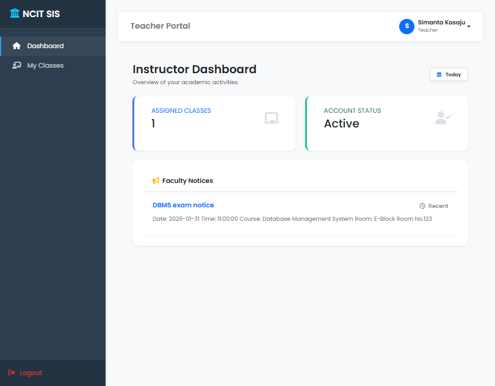

# NCIT_SIS

NCIT_SIS is a Flask + MySQL student information system with role-based access for admins, teachers, and students.

## Features

- Role-based dashboards (admin / teacher / student)
- Student enrollment and course management
- Attendance tracking
- Exam schedules, results, and GPA calculation
- Fees management
- Library inventory and borrowing
- Notices and announcements
- User profile and settings

## Gallery

Screenshots live in `docs/screenshots/`.

<table>
  <tr>
    <td align="center">
      
      <br>
      <sub><b>Login</b> - User authentication screen.</sub>
    </td>
    <td align="center">
      
      <br>
      <sub><b>Admin Dashboard</b> - Overview of totals, notices, and quick stats.</sub>
    </td>
  </tr>
  <tr>
    <td align="center">
      
      <br>
      <sub><b>Student Dashboard</b> - Courses, results, fees, and notices at a glance.</sub>
    </td>
    <td align="center">
      
      <br>
      <sub><b>Teacher Dashboard</b> - Assigned classes and recent notices.</sub>
    </td>
  </tr>
</table>

## Tech stack

- Python 3
- Flask + Jinja2 templates
- MySQL (mysql-connector-python)
- python-dotenv
- HTML/CSS in `templates/` and `static/`

## Project layout

- `app.py` - main application entry point
- `schema.sql` - MySQL schema dump
- `scripts/` - seed and maintenance scripts
- `templates/` - HTML templates
- `static/` - static assets

## Prerequisites

- Python 3.10+ (3.11/3.12 OK)
- MySQL 8+ (or compatible)
- Windows/macOS/Linux

## Setup (local)

1. Create and activate a virtual environment:

```bash
python -m venv venv
# Windows
venv\Scripts\activate
# macOS/Linux
source venv/bin/activate
```

2. Install dependencies:

```bash
pip install -r requirements.txt
```

3. Create your environment file:

```bash
# Windows
copy .env.example .env
# macOS/Linux
cp .env.example .env
```

4. Update values in `.env` (secret key and DB credentials).
5. Create the database and tables (see Database section).

## Environment

- `SECRET_KEY` - Flask secret key
- `DB_HOST` - MySQL host
- `DB_USER` - MySQL username
- `DB_PASSWORD` - MySQL password
- `DB_NAME` - database name
- `DB_PORT` - MySQL port

## Database

Create the database:

```sql
CREATE DATABASE ncit_sis;
```

Minimum schema expected by the app (key columns):

- `users`: `user_id`, `full_name`, `email`, `password`, `role`, `dept_id`, `semester`, `roll_no`, `enroll_date`, `contact_no`, `gender`, `address`
- `departments`: `dept_id`, `dept_name`, `hod_name`
- `courses`: `course_id`, `course_name`, `course_code`, `dept_id`
- `teacher_courses`: `assign_id`, `teacher_id`, `course_id`
- `student_enrollments`: `student_id`, `course_id`, `date_enrolled`
- `attendance`: `course_id`, `student_id`, `attendance_date`, `status`
- `student_results`: `result_id`, `student_id`, `course_id`, `marks_obtained`, `full_marks`, `grade`, `gpa`, `exam_type`
- `exam_schedule`: `exam_id`, `course_id`, `exam_date`, `start_time`, `room_no`
- `fees`: `fee_id`, `student_id`, `amount`, `description`, `status`
- `notices`: `notice_id`, `title`, `content`, `target_role`, `date_posted`
- `book_categories`: `category_id`, `name`
- `library_books`: `book_id`, `title`, `author`, `category_id`, `isbn`, `copies_total`
- `borrows`: `borrow_id`, `book_id`, `student_id`, `borrow_date`, `due_date`, `return_date`, `fine`

Schema file:

- `schema.sql` includes a full MySQL dump you can import.
- The schema now includes stricter domain checks (`CHECK`), nullability rules, and composite uniqueness for data integrity.

Import example:

```bash
mysql -u root -p ncit_sis < schema.sql
```

If you already have an older database, re-importing `schema.sql` is the easiest way to apply all constraints.  
Back up your data first.

Seed at least one admin user, departments, and courses so dashboards have data.

Password security:

- New users are stored with hashed passwords.
- Existing plaintext passwords can still log in and will be upgraded on successful login.
- You can also hash all existing passwords at once with `python scripts/upgrade_passwords.py`.
- Forgot-password supports OTP delivery via SMTP email or Twilio SMS, with automatic channel fallback when possible.
- In local testing, when delivery is unavailable, OTP can be shown in UI flash messages if `PWD_RESET_ALLOW_LOCAL_TEST_CODE=1`.

## Seed data

Create an admin user:

```bash
python scripts/seed_admin.py
```

Test password-reset delivery providers:

```bash
# SMTP check
python scripts/test_password_reset_delivery.py --email your_mail@example.com

# Twilio check
python scripts/test_password_reset_delivery.py --phone +97798XXXXXXXX

# Check both in one run
python scripts/test_password_reset_delivery.py --email your_mail@example.com --phone +97798XXXXXXXX
```

## Run

```bash
python app.py
```

The app runs in debug mode by default and listens on port 5000.
