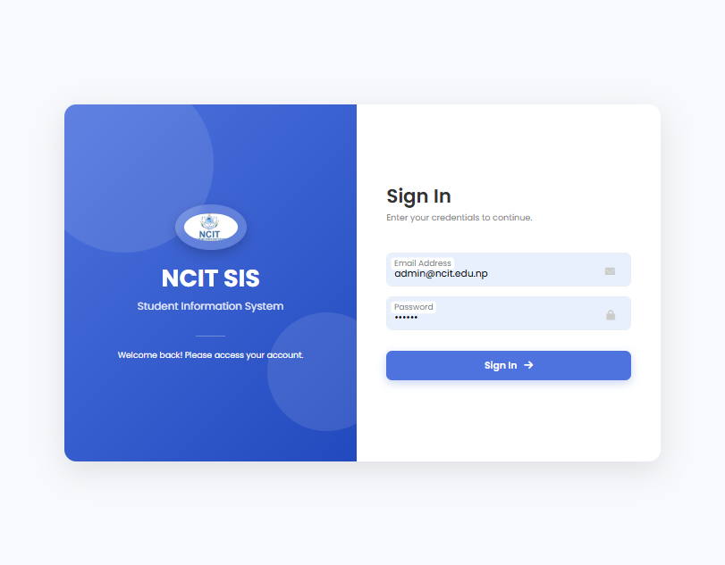
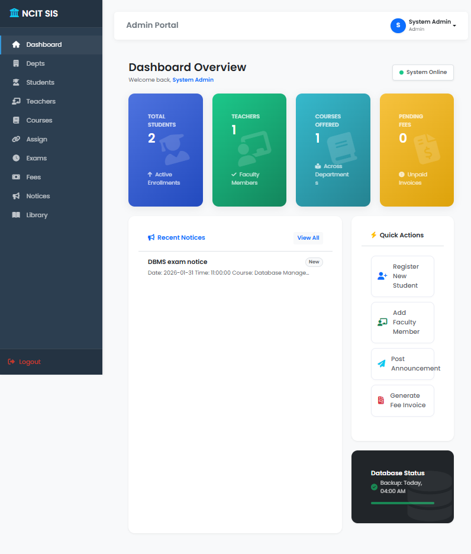
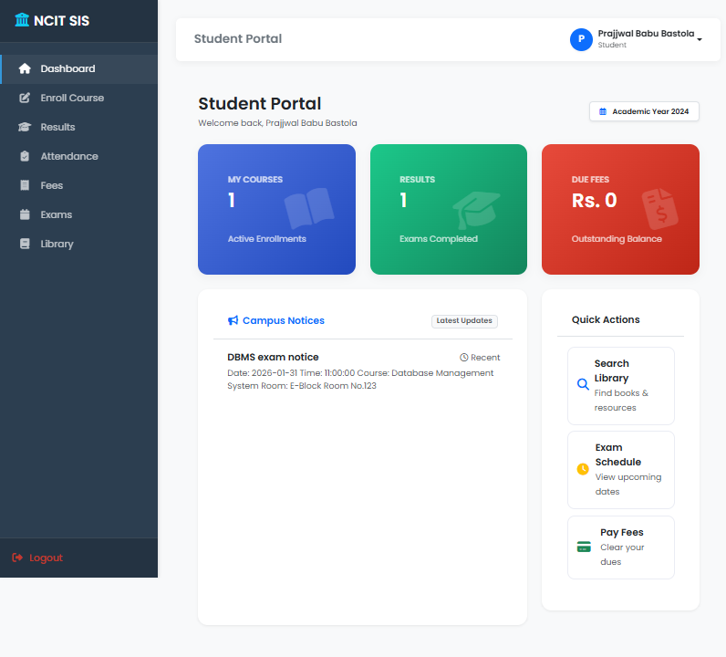

# NCIT_SIS

NCIT_SIS is a Flask + MySQL student information system with role-based access for admins, teachers, and students.

## Features

- Role-based dashboards (admin / teacher / student)
- Student enrollment and course management
- Attendance tracking
- Exam schedules, results, and GPA calculation
- Fees management
- Library inventory and borrowing
- Notices and announcements
- User profile and settings

## Screenshots

Add screenshots under `docs/screenshots/` and update the links below.





## Tech stack

- Python 3
- Flask + Jinja2 templates
- MySQL (mysql-connector-python)
- HTML/CSS in `templates/` and `static/`

## Project layout

- `app.py` - main application entry point
- `templates/` - HTML templates
- `static/` - static assets

## Prerequisites

- Python 3.10+ (3.11/3.12 OK)
- MySQL 8+ (or compatible)
- Windows/macOS/Linux

## Setup (local)

1. Create and activate a virtual environment:

```bash
python -m venv venv
# Windows
venv\Scripts\activate
# macOS/Linux
source venv/bin/activate
```

2. Install dependencies:

```bash
pip install -r requirements.txt
```

3. Configure MySQL connection values in `app.py`.
4. Create the database and tables (see Database section).

## Configuration

- `app.secret_key` in `app.py`
- MySQL connection in `get_db()` inside `app.py`

## Database

Create the database:

```sql
CREATE DATABASE ncit_sis;
```

Minimum schema expected by the app (key columns):

- `users`: `user_id`, `full_name`, `email`, `password`, `role`, `dept_id`, `semester`, `roll_no`, `enroll_date`, `contact_no`, `gender`, `address`
- `departments`: `dept_id`, `dept_name`, `hod_name`
- `courses`: `course_id`, `course_name`, `course_code`, `dept_id`
- `teacher_courses`: `assign_id`, `teacher_id`, `course_id`
- `student_enrollments`: `student_id`, `course_id`, `date_enrolled`
- `attendance`: `course_id`, `student_id`, `attendance_date`, `status`
- `student_results`: `result_id`, `student_id`, `course_id`, `marks_obtained`, `full_marks`, `grade`, `gpa`, `exam_type`
- `exam_schedule`: `exam_id`, `course_id`, `exam_date`, `start_time`, `room_no`
- `fees`: `fee_id`, `student_id`, `amount`, `description`, `status`
- `notices`: `notice_id`, `title`, `content`, `target_role`, `date_posted`
- `book_categories`: `category_id`, `name`
- `library_books`: `book_id`, `title`, `author`, `category_id`, `isbn`, `copies_total`
- `borrows`: `borrow_id`, `book_id`, `student_id`, `borrow_date`, `due_date`, `return_date`, `fine`

Seed at least one admin user, departments, and courses so dashboards have data.

Note: current login compares plaintext passwords in the `users` table. If you switch to hashed passwords, update the login logic accordingly.

## Run

```bash
python app.py
```

The app runs in debug mode by default and listens on port 5000.
